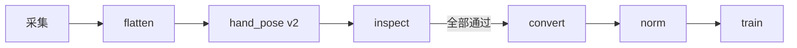
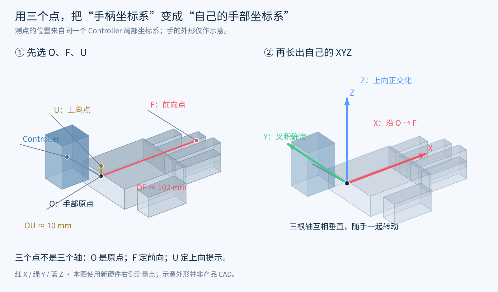
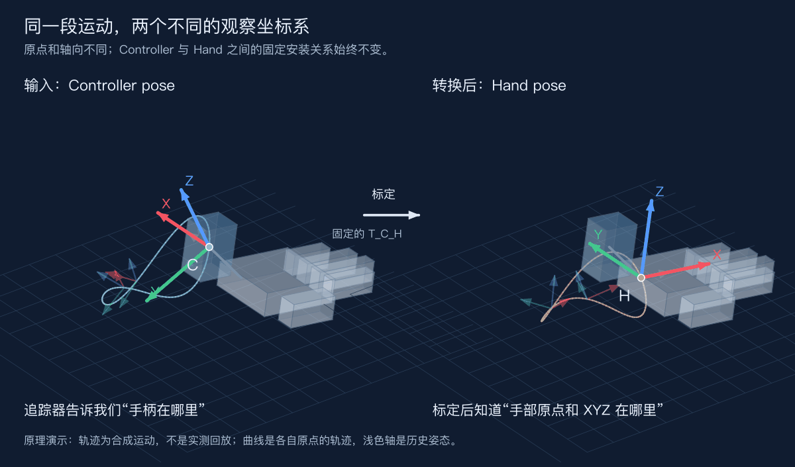

# UMI Data Processing

把 UMI 采集数据整理成可训练的 LeRobot 数据集，并接到 OpenPI。

采集目录 → 平摊 episode → 手柄转 `hand_pose` → 转 LeRobot → 算 masked norm → 训练。



默认训练规格是 **10 Hz / H50**。改 FPS 或 action horizon 时，数据集路径、repo id、norm 资产和训练配置必须一起换，不能沿用旧统计量。

## 目录

- [Hand 坐标系](#hand-坐标系)
- [环境](#环境)
- [五步流程](#五步流程)
- [数据契约](#数据契约)
- [安全约定](#安全约定)
- [可选工具](#可选工具)
- [仓库结构](#仓库结构)
- [更多文档](#更多文档)

---

## Hand 坐标系

用三个点定义手部坐标： **O 定原点，F 定前向，U 给上向提示**。红 X、绿 Y、蓝 Z 是得到的右手系。



Controller 与 Hand 是同一刚体、同一时刻；标定只改参考原点和轴向。下面是原理动画，不是实测回放：



完整推导见 [docs/controller-to-hand-calibration.md](docs/controller-to-hand-calibration.md)。当前转换脚本是 `controller_to_hand_pose_v2.py`：内置 2026-09-09 `test_true` 标定，默认沿最终 Hand 局部 X 轴偏移 **−42 mm**，写出上一帧末端坐标系中的相对增量。

---

## 环境

在仓库根目录执行命令。

| 步骤 | 解释器 | 依赖 |
| --- | --- | --- |
| flatten、hand_pose v2 | `python3`（3.8+） | 仅标准库 |
| inspect / convert / norm / 训练 | OpenPI 虚拟环境 | NumPy、PyArrow、ffmpeg / ffprobe |

先设好路径，后面命令都用这些变量：

```bash
cd /path/to/umi_data_all_process

PY=/path/to/openpi/.venv/bin/python          # 转换、norm、训练用
DATA_ROOT=/path/to/umi_v2/data/task_v2_x2    # 已平摊的 episode 根目录
DATASET=/path/to/umi_v2/datasets/task_v2_x2_lerobot_10hz_h50
REPO_ID=yourname/task_v2_x2_lerobot_10hz_h50
TASK='Put the two objects into the box.'
ASSET_ID=umi_task_v2_x2_10hz_h50_masked_v1
ASSETS=/path/to/openpi/data/assets
```

---

## 五步流程

按顺序做，不要跳步。

### 1. 平摊采集目录

如果任务根目录下还是 `collector_run_*`，先把 episode 提到同一层。已经是 `YYYYMMDD_HHMMSS_...` 目录的跳过。

```bash
python3 flatten_data.py "$DATA_ROOT" \
  --parent-pattern 'collector_run_*' \
  --remove-empty-parents \
  --verbose
```

确认计划后加上 `--execute`。转换器只扫描 `--source` 的直接子目录，不递归。

### 2. 生成 `camera/hand_pose.csv`

```bash
python3 controller_to_hand_pose_v2.py "$DATA_ROOT" \
  --input-glob '**/camera/e6_rgb_controller_poses.csv' \
  --verbose
```

确认后加 `--execute`。默认输出就在每个输入旁边的 `camera/hand_pose.csv`，也是下一步唯一读取的手部位姿文件。

```python
T[t] = T[t - 1] @ D[t]   # 第一帧是单位增量
```

| 情况 | 做法 |
| --- | --- |
| 已有 `hand_pose.csv`，确认按当前标定重算 | `--overwrite` |
| 同一标定的批次续跑 | `--skip-existing` |
| 原始左右通道和物理手相反 | `--side-map swapped` |

`--skip-existing` 只看文件在不在，不检查标定版本。重新应用 −42 mm 标定时不要用它。参数说明见 [README.controller_to_hand_pose_v2.md](README.controller_to_hand_pose_v2.md)。

### 3. 转 LeRobot

每个源 episode 必须恰好输出一个 LeRobot episode，ID 保持原文件夹名。`--fps` 必须能整除源 E6 帧率（60 Hz 源可用 10 / 15 / 20 / 30 / 60）。

先自检，再只读预检：

```bash
$PY conversion_tools/umi_folder_to_lerobot.py self-test

$PY conversion_tools/umi_folder_to_lerobot.py inspect \
  --source "$DATA_ROOT" \
  --target "$DATASET" \
  --repo-id "$REPO_ID" \
  --task "$TASK" \
  --fps 10 \
  --action-horizon 50 \
  --max-alignment-ms 100 \
  --max-hand-age-ms 100 \
  --hand-alignment nearest \
  --compact
```

`inspect` 不创建目标目录。同时满足下面三项再转换：

- `status` 为 `"ok"`
- `failure_count` 为 `0`
- `one_source_one_output_episode` 为 `true`

返回码 `1` 且 `status: "failed"` 表示数据没过预检，不是脚本崩溃；具体原因在 `failures`。

只转筛选后的 episode 时，`inspect` 和 `convert` 都加上：

```bash
--episode-list /absolute/path/pass_episodes.txt
```

预检通过后：

```bash
$PY conversion_tools/umi_folder_to_lerobot.py convert \
  --source "$DATA_ROOT" \
  --target "$DATASET" \
  --repo-id "$REPO_ID" \
  --task "$TASK" \
  --fps 10 \
  --action-horizon 50 \
  --max-alignment-ms 100 \
  --max-hand-age-ms 100 \
  --hand-alignment nearest \
  --video-workers 4 \
  --confirm CREATE_LEROBOT_DATASET
```

目标目录默认必须不存在。只有目录完全为空时才可以加 `--replace-empty-target`，它不会覆盖已有数据集。

默认转换器保留完整时间线，对齐误差写入审计，不自动裁掉 episode。若要求「一个源 episode 恰好一段可输出连续数据，否则整批拒绝」，改用 `umi_folder_to_lerobot_strict.py`。预检和转换必须用同一个脚本。细节见 [conversion_tools/README_umi_folder_to_lerobot.md](conversion_tools/README_umi_folder_to_lerobot.md)。

### 4. 计算 OpenPI norm

转换结果里的 `meta/stats.json` 不能直接拿来训练。训练用 masked 统计：**所有 state 都计入，action 只保留 `action_is_pad=False` 的真实 slot**。

```bash
$PY training_tools/compute_masked_norm_stats.py \
  --dataset "$DATASET" \
  --assets-base-dir "$ASSETS" \
  --asset-id "$ASSET_ID" \
  --expected-fps 10 \
  --expected-horizon 50 \
  --expected-task "$TASK"
```

`--asset-id` 必须是新名字。已有资产目录会直接拒绝，避免覆盖旧实验。

### 5. 开始训练

每个实验在 `training_tools/<实验名>/` 下，入口是该目录的 `start_training.sh` 和 README。先核对 config、exp-name、数据集和 asset id 一致，再检查、后启动：

```bash
bash training_tools/<experiment>/start_training.sh --check-only
bash training_tools/<experiment>/start_training.sh
```

启动器会先跑 CPU smoke，再等待 GPU 空闲。它不会杀掉其他训练，也不会覆盖已有同名 checkpoint / 日志。重跑必须换 `--exp-name`。

---

## 数据契约

| 字段 | 形状 / 规则 |
| --- | --- |
| 视觉 | E6 完整右眼、cam0 左腕、cam1 右腕；head 按实际 HEVC 宽高裁右半幅 |
| `observation.state` | `(30,)`，左右 EEF 相对增量 + 绝对手指 |
| `action` | `(H, 30)`，同一 chunk 共用当前帧锚点 |
| `action_is_pad` | `(H,)`，训练 loss 必须逐 slot 屏蔽 padding |
| state | `inverse(T[t-1]) @ T[t]` |
| action | `inverse(T[t]) @ T[t+k]` |

OpenPI 保持 `action_sequence_keys = ()`：不要再切 future chunk，也不要再算一遍 EEF delta。

---

## 安全约定

- **flatten / hand_pose**：默认只预览，确认后再 `--execute`
- **convert**：只读源数据，在临时目录完成后原子发布
- **norm / 训练**：拒绝覆盖已有输出
- 改 FPS 或 H 时，数据集、norm、训练配置必须一起重生

---

## 可选工具

主流程不依赖这些工具。

| 工具 | 用途 |
| --- | --- |
| [`data_choose/`](data_choose/) | 浏览器筛选 episode，导出 `--episode-list` |
| [`review_tools/rgb_review_app.py`](review_tools/rgb_review_app.py) | RGB 快速审核 |
| [`random_replay_5090/`](random_replay_5090/) | MuJoCo 回放并导出 MP4 |

```bash
$PY review_tools/rgb_review_app.py --root "$DATA_ROOT" --host 0.0.0.0 --port 8090

python3 random_replay_5090/random_replay_5090.py "$DATA_ROOT" \
  --camera-view front --no-viewer
```

---

## 仓库结构

```text
.
├── flatten_data.py                       # 平摊 collector_run_*
├── controller_to_hand_pose_v2.py         # 手柄 → camera/hand_pose.csv
├── conversion_tools/
│   ├── umi_folder_to_lerobot.py          # 通用转换（完整时间线）
│   ├── umi_folder_to_lerobot_strict.py   # 多段连续数据则拒绝
│   └── episode_lists/                    # 可选 episode 白名单
├── training_tools/
│   ├── compute_masked_norm_stats.py      # OpenPI masked norm
│   └── <experiment>/start_training.sh    # 该实验的启动入口
├── data_choose/                          # 可选：episode 筛选
├── review_tools/                         # 可选：RGB 审核
├── random_replay_5090/                   # 可选：仿真回放
└── docs/                                 # Hand 坐标系图解
```

```bash
python3 flatten_data.py --help
python3 controller_to_hand_pose_v2.py --help
$PY conversion_tools/umi_folder_to_lerobot.py --help
$PY training_tools/compute_masked_norm_stats.py --help
```

---

## 更多文档

- [三点定义 Hand 坐标系](docs/controller-to-hand-calibration.md)
- [hand_pose v2 标定与参数](README.controller_to_hand_pose_v2.md)
- [LeRobot 转换器说明](conversion_tools/README_umi_folder_to_lerobot.md)
