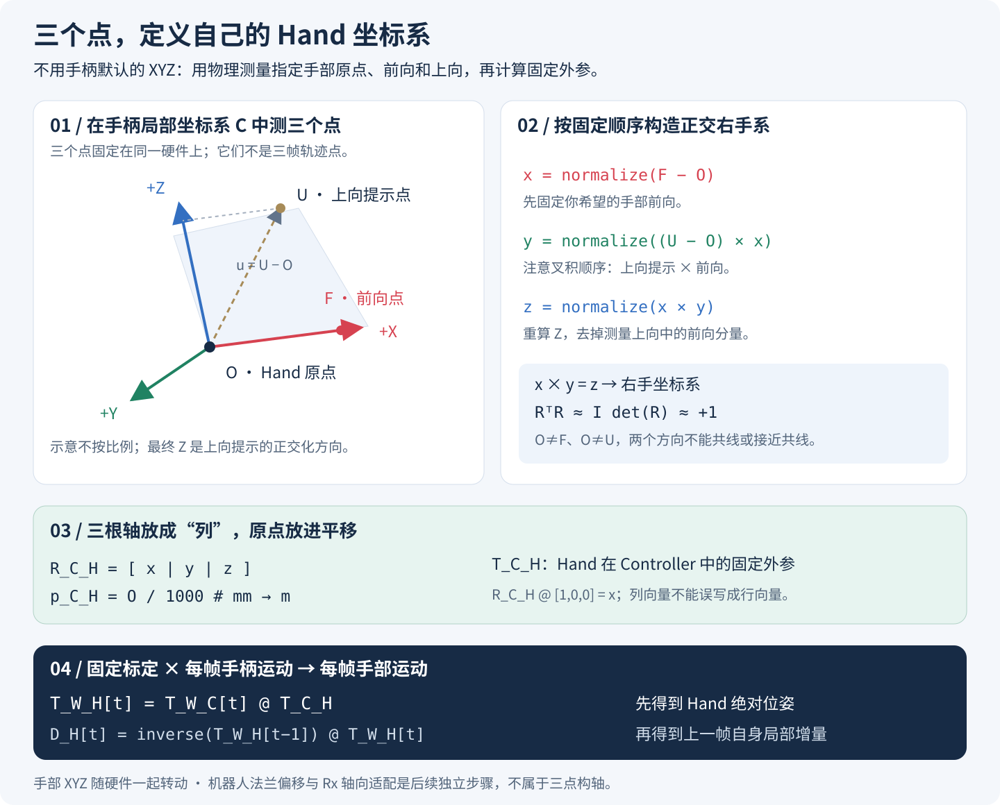

# 用三个点定义自己的 Hand 坐标系

我们的目标不是直接使用手柄的原生 XYZ，而是**在手柄固定连接的手部上，定义一个符合操作习惯的坐标系：+X 向前、+Z 向上、+Y 按右手规则确定**。然后将每一帧的 `controller_pose` 转换到这个手部坐标系。



图中几何关系为原理示意，不是硬件尺寸图。这里的“向前”“向上”指手部自身的方向；手转动后，它们也跟着手转动，并不始终指向世界前方或重力上方。

## 1. 三个点分别是什么意思？

三个点必须在**同一个手柄局部坐标系 C** 中测量，并在硬件上保持固定关系。不能混入不同帧的世界坐标、相机坐标或未对齐的 CAD 坐标。

| 点 | 配置字段 | 物理含义 | 它决定什么 |
| --- | --- | --- | --- |
| O | `origin_mm` | 希望用作手部末端参考点的位置 | Hand 的原点 |
| F | `forward_mm` | 从 O 沿希望的手部前向选取的一点 | Hand 的 +X 方向 |
| U | `up_mm` | 从 O 向希望的手部上方选取的一点 | +Z 的朝向提示，并与 X 一起确定坐标平面 |

**这不是“三个点各代表一个轴”。** O 是原点，F 和 U 提供两个方向；第三个方向由叉积算出。点之间不要求距离为 1，也不要求严格成直角。

选点时，O 与 F 不可重合，O 与 U 不可重合，`F−O` 和 `U−O` 不可平行或接近平行。测量基线过短或近共线会放大噪声。

## 2. 从 O、F、U 构造正交右手 XYZ

令 `normalize(v) = v / ||v||`，按照以下固定顺序计算：

```text
x = normalize(F - O)              # 保留指定的前向
u = U - O                        # 上向提示，不直接作为最终 Z 轴
y = normalize(u × x)              # 注意顺序：up cross x
z = normalize(x × y)              # 重算 Z，保证与 X、Y 正交
```

最终 Z 等价于将上向提示投影到垂直于 X 的平面后归一化：

```text
z = normalize(u - dot(u, x) * x)
```

所以即使测量得到的 `U−O` 与 X 不完全垂直，也能得到正交坐标系。**最终 Z 不一定恰好穿过测量点 U**，但指向 U 在该垂直平面上的投影方向。

这套定义满足 `x × y = z`，并优先保留 X 的方向。检查结果应有 `RᵀR≈I`、`det(R)≈+1`。行列式为 −1 是反射，不是可用四元数表示的旋转。

## 3. 三根轴如何组成 Controller → Hand 外参？

用 `T_A_B` 表示“B 坐标系在 A 中的位姿”，其作用是把 B 中的坐标映射到 A。每根轴 `x,y,z` 都是在 C 中表达的 Hand 单位轴，因此它们放在旋转矩阵的**列**中：

```text
          [ x0  y0  z0 ]
R_C_H  =  [ x1  y1  z1 ]          p_C_H = O / 1000  # mm → m
          [ x2  y2  z2 ]

          [ R_C_H  p_C_H ]
T_C_H  =  [ 0 0 0    1   ]
```

直接检验方向：`R_C_H @ [1,0,0] = x`。如果把这些向量放成行，就得到逆向旋转，含义不同。

名字“Controller → Hand”描述的是**位姿处理流程**；矩阵 `T_C_H` 本身将 Hand 点坐标映射到 Controller。若需要把一个点从 C 表达到 H，应该用 `inverse(T_C_H)`，不要被名称误导。

## 4. 本项目的一组三点测量示例

以下是新硬件实际提供的右侧测量点，单位 mm。这里只演示三点法，**不是宣布替换旧硬件标定或脚本默认值**。

| 点 | Controller 原生 X | Controller 原生 Y | Controller 原生 Z |
| --- | ---: | ---: | ---: |
| O：原点 | 7.435 | −15.192 | −53.839 |
| F：前向点 | 7.435 | −100.782 | −109.321 |
| U：上向点 | 7.435 | −20.632 | −45.448 |

`||F−O||≈102.000 mm`，`||U−O||≈10.000 mm`。按上述公式计算，保留 9 位小数：

```text
R_C_H（原生 UMI 手柄坐标基） =
[ 0.000000000   1.000000000   0.000000000 ]
[-0.839121663   0.000000000  -0.543943780 ]
[-0.543943780   0.000000000   0.839121663 ]

p_C_H = [0.007435, -0.015192, -0.053839] m
```

该硬件左侧按测量约定将三个点的**原生 Controller X 分量取负**，再重新执行叉积构造。由于本例三个点的 X 相同，取负后 `F−O`、`U−O` 不变，所以两侧旋转矩阵相同，原点 X 符号相反。这不矛盾，也不需要额外 `Rx(90°)` 才成为右手系。

旧版一体化脚本的内置测量点不同。例如右侧 `O=[16.506,57.416,135.536]`、`F=[-85.494,57.416,135.536]`、`U=[16.506,52.244,126.976]` mm。**不同硬件必须使用对应的 O、F、U，不能把新方向和旧原点无意混用。** 有意进行“只改旋转”的实验时，也应明确记录保留了哪一版原点。

## 5. 原生 UMI 与 ROS 表示不能混用

上面数值在原生 UMI 手柄坐标基中。脚本默认 ROS 映射为：

```text
v_ROS = A @ v_UMI = (-z, -x, y)_UMI
A = [[0,0,-1], [-1,0,0], [0,1,0]]
```

对于这组三点定义出的同一个 Hand 坐标系 H，只改变它在 Controller 中的表达基：`R_Cros_H = A @ R_Cumi_H`，`p_Cros_H = A @ p_Cumi_H`，得到：

```text
R_Cros_H =
[ 0.543943780   0.000000000  -0.839121663 ]
[ 0.000000000  -1.000000000   0.000000000 ]
[-0.839121663   0.000000000  -0.543943780 ]
p_Cros_H = [0.053839, -0.007435, -0.015192] m  # 右侧
```

输入 Controller 绝对旋转在世界和 Controller 两端一起换基时，使用 `R′_W_C = A @ R_W_C @ Aᵀ`，位置使用 `p′=A@p`。这与标定矩阵只对父系换基的 `A @ R_C_H` 不同。必须先统一表示，再组合；ROS 换基不是机器人基座外参标定。

## 6. 每帧 Controller 绝对位姿 → Hand 绝对位姿

三点标定只在硬件安装关系改变时重算；采集时每一帧使用同一个 `T_C_H`：

```text
T_W_H[t] = T_W_C[t] @ T_C_H
R_W_H[t] = R_W_C[t] @ R_C_H
p_W_H[t] = p_W_C[t] + R_W_C[t] @ p_C_H
```

这里 W 是采集参考系。位置偏移也要乘当帧手柄旋转；不能直接把固定偏移加到世界 X/Y/Z 上。至此得到的是 Hand 的**绝对**位姿，还不是原来的相对 `hand_pose.csv`。

## 7. Hand 绝对位姿 → 原有 hand_pose 局部增量

```text
D_H[t] = inverse(T_W_H[t-1]) @ T_W_H[t]
d_p_H = R_W_H[t-1]ᵀ @ (p_W_H[t] - p_W_H[t-1])
d_R_H = R_W_H[t-1]ᵀ @ R_W_H[t]
```

即“相对上一帧，表达在上一帧 Hand 自身坐标系中的变化”。四元数以 `qx,qy,qz,qw`（xyzw）保存，平移以米保存；它是位姿增量，不是速度。回放须从选定初始位姿**右乘**：`T[t] = T[t-1] @ D_H[t]`。

第一行没有上一帧，使用单位增量并标记 `relative_valid=0`；无效相邻行不能当作真实零运动。增量 CSV 不包含起始绝对位姿，也不能恢复无效区间丢失的位移。“上一帧”指 CSV 上一行，不保证帧号相差 1，应保留 `previous_frame_number` 和 `dt_ns`。

**与机器人适配的边界：** `hand_pose.csv` 的名字不保证它仍使用标准 H 坐标系。一体化脚本的 `x2-revo2` profile 会进一步做 `D_E = inverse(T_H_E) @ D_H @ T_H_E`，以适配左右 `Rx(±90°)`；部分版本还支持法兰原点偏移。它们是后续机器人安装适配，不属于三点构造 H 的必要步骤，也不能在回放时重复施加。复用时必须记录标定、profile、原点偏移及脚本版本。

## 8. 可直接复现的三点计算

以下代码只使用 Python 标准库，输出原生 Controller 表示中的外参。保存为独立脚本即可运行；它不读取或改写数据集。

```python
from math import sqrt

def sub(a, b): return [a[i] - b[i] for i in range(3)]
def dot(a, b): return sum(x*y for x, y in zip(a, b))
def cross(a, b):
    return [a[1]*b[2]-a[2]*b[1], a[2]*b[0]-a[0]*b[2], a[0]*b[1]-a[1]*b[0]]
def unit(v):
    n = sqrt(dot(v, v))
    if n < 1e-12: raise ValueError("重合点或共线方向")
    return [a/n for a in v]

O = [7.435, -15.192, -53.839]       # mm；Hand 原点
F = [7.435, -100.782, -109.321]     # mm；Hand 前向点
U = [7.435, -20.632, -45.448]       # mm；Hand 上向提示点
x = unit(sub(F, O))
u = unit(sub(U, O))
if sqrt(dot(cross(u, x), cross(u, x))) < 1e-6:
    raise ValueError("方向接近共线，无法稳定定义坐标系")
y = unit(cross(u, x))
z = unit(cross(x, y))
R = [[x[i], y[i], z[i]] for i in range(3)]  # 轴放在列
p = [v/1000 for v in O]
assert abs(dot(x, cross(y, z)) - 1) < 1e-9
assert max(abs(dot(a,b)) for a,b in [(x,y),(x,z),(y,z)]) < 1e-9
print("R_C_H =", R)
print("p_C_H (m) =", p)
```

实现对应 [`controller_to_hand_pose.py`](../controller_to_hand_pose.py) 中的 `hand_offset`（三点构轴）、`compose_pose`（绝对位姿组合）、`relative_pose`（相邻帧局部增量）。本次仅补充图文，不修改标定、处理脚本或已有 CSV。
